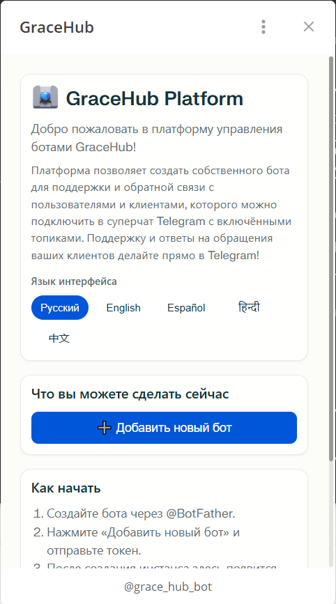
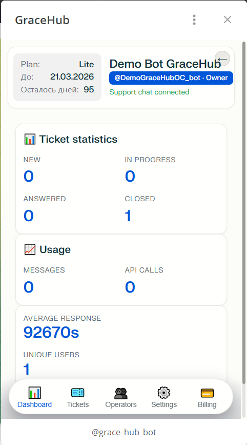
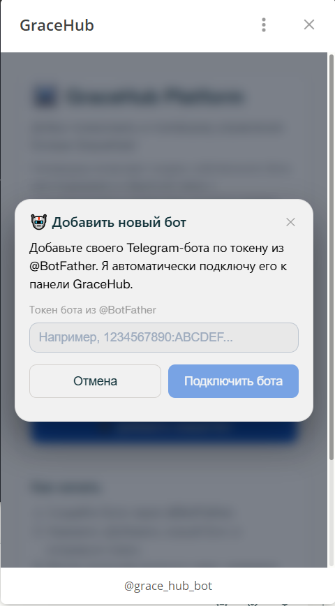
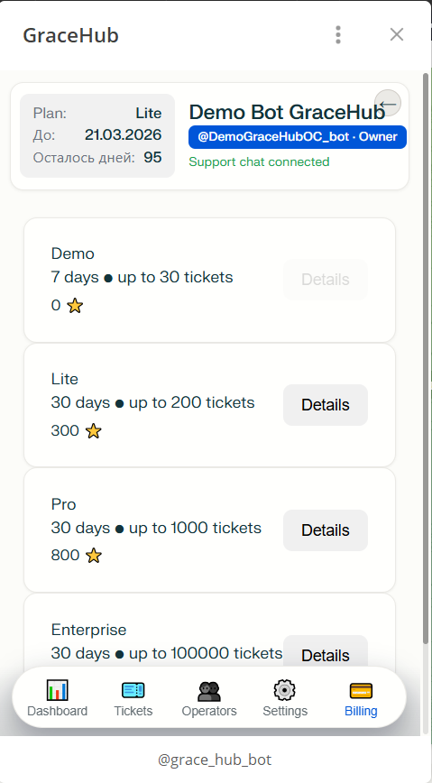
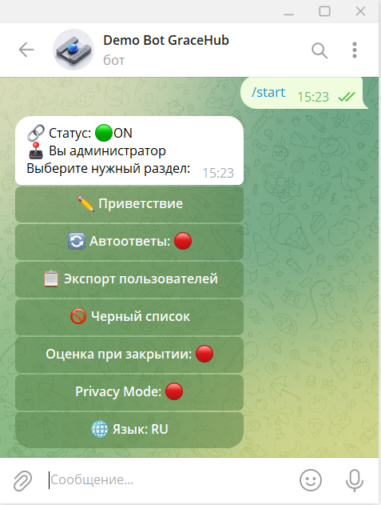
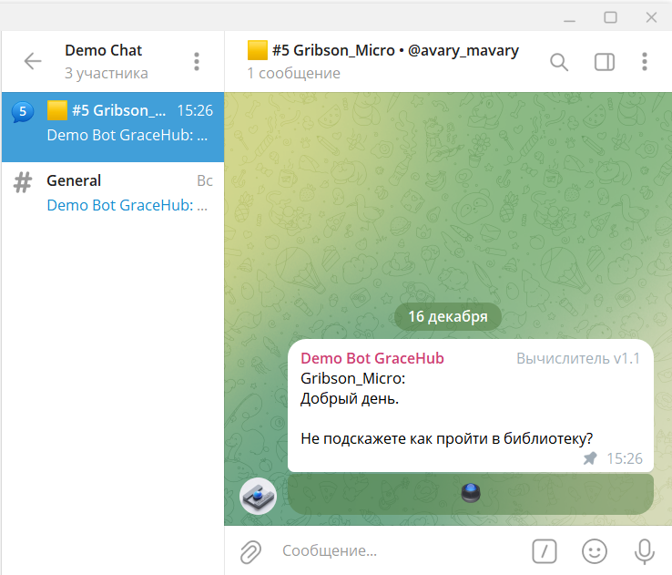
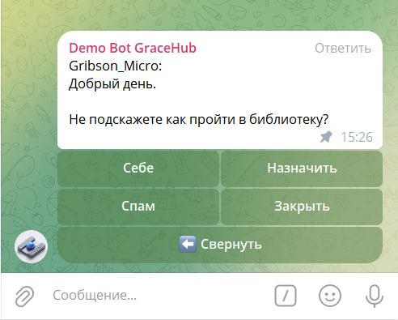

<div align="right">
  <a href="README.md">🇷🇺 Русский</a> •
  <a href="README.en.md">🇬🇧 English</a> •
  <a href="README.es.md">🇪🇸 Español</a> •
  <a href="README.hi.md">🇮🇳 हिन्दी</a> •
  <a href="README.zh.md">🇨🇳 简体中文</a>
</div>

<div align="center">

> ⚠️ **महत्वपूर्ण:** यह प्रोजेक्ट **अल्फा परीक्षण** चरण में है।
> कार्यक्षमता बदल सकती है, त्रुटियाँ और अस्थिर संचालन संभव है।
> सावधानी से उपयोग करें और किसी भी समस्या की रिपोर्ट करें।

</div>

---

<div align="center">
  <table cellpadding="0" cellspacing="0" style="border: none;">
    <tr>
      <td style="padding: 0; border: none; vertical-align: middle;">
        
      </td>
      <td style="padding: 0 0 0 20px; border: none; vertical-align: middle;">
        <h1 style="margin: 0;">GraceHub Platform</h1>
      </td>
    </tr>
  </table>
</div>

GraceHub एक SaaS प्लेटफॉर्म है जो आपको सीधे Telegram में अपना समर्थन तैनात करने की अनुमति देता है, साथ ही छोटे और मध्यम आकार के व्यवसायों के लिए प्रतिक्रिया बॉट और तकनीकी समर्थन सेवाओं का प्रदाता बनने में सक्षम बनाता है।

**🌐 वेबसाइट:** [gracehub.ru](https://gracehub.ru)  
**📢 Telegram चैनल:** [@gracehubru](https://t.me/gracehubru)  
**👨‍💻 डेवलपर:** [@Gribson_Micro](https://t.me/Gribson_Micro)  
**🗺️ रोडमैप:** [ROADMAP.md](./ROADMAP.md)

<div align="center">
  <h3>📱 इंटरफेस के स्क्रीनशॉट</h3>
  <table>
    <tr>
      <td align="center"></td>
      <td align="center"></td>
      <td align="center"></td>
    </tr>
    <tr>
      <td align="center"><em>स्टार्ट पेज</em></td>
      <td align="center"><em>डैशबोर्ड</em></td>
      <td align="center"><em>बॉट जोड़ना</em></td>
    </tr>
    <tr>
      <td align="center"></td>
      <td align="center"></td>
      <td align="center"></td>
    </tr>
    <tr>
      <td align="center"><em>भुगतान अनुभाग</em></td>
      <td align="center"><em>मुख्य बॉट जहां आप सपोर्ट बॉट को बांध सकते हैं</em></td>
      <td align="center"><em>सपोर्ट बॉट एडमिन मेनू</em></td>
    </tr>
    <tr>
      <td align="center"></td>
      <td align="center"></td>
      <td align="center"></td>
    </tr>
    <tr>
      <td align="center"><em>ग्राहक का अनुरोध प्राप्त</em></td>
      <td align="center"><em>टिकट प्रबंधन मेनू</em></td>
      <td align="center"><em>ग्राहक को उत्तर</em></td>
    </tr>
  </table>
</div>

## मुख्य विशेषताएं

- **मास्टर बॉट** — सभी प्रतिक्रिया बॉट को बांधने के लिए नियंत्रण केंद्र
- **Mini App व्यक्तिगत कैबिनेट** — बॉट और क्लाइंट्स को प्रबंधित करने के लिए सहज इंटरफेस
- **सांख्यिकी और विश्लेषण** — प्रत्येक बॉट के लिए मेट्रिक्स ट्रैक करें
- **बिलिंग सिस्टम** — स्वचालित गणना और भुगतान प्रबंधन

## 🌍 समर्थित भाषाएं

- 🇷🇺 Русский
- 🇬🇧 English
- 🇪🇸 Español
- 🇮🇳 हिन्दी
- 🇨🇳 简体中文

## 🛠 तकनीकी स्टैक

| घटक | तकनीक |
|-----------|-----------:|
| Backend | Python (FastAPI, Hypercorn) |
| Frontend | React 19 + TypeScript + Vite |
| बॉट प्रबंधन | Telegram Bot API |
| डेटाबेस | PostgreSQL 15+ |
| प्रॉक्सी | Nginx |
| Python संस्करण | 3.10+ |

## 📁 परियोजना संरचना

```
gracehub/
├── src/
│   └── master_bot/
│       ├── main.py                 # मास्टर बॉट प्रवेश बिंदु
│       ├── api_server.py           # REST API सर्वर
│       └── worker/                 # उदाहरण कार्यकर्ता
├── frontend/miniapp_frontend/      # React एप्लिकेशन
├── config/                         # कॉन्फ़िगरेशन फ़ाइलें
├── scripts/
│   └── launch.sh                   # लॉन्च स्क्रिप्ट
├── logs/                           # एप्लिकेशन लॉग
└── .env                            # पर्यावरण चर
```

### 💳 समर्थित भुगतान प्रणालियां

प्लेटफॉर्म सहायता सेवाओं के लिए भुगतान स्वीकार करने के लिए निम्नलिखित भुगतान प्रणालियों के साथ एकीकृत है:

| प्रणाली | भुगतान विधि | तकनीकी विशेषताएं |
| :--- | :--- | :--- |
| **Telegram Stars** | Telegram मूल मुद्रा | [Telegram Mini Apps Billing](https://core.telegram.org/bots/payments) के साथ सीधा एकीकरण। भुगतान Telegram प्लेटफॉर्म के भीतर संसाधित किए जाते हैं। |
| **TON Coin** | क्रिप्टोकरेंसी (Toncoin) | TON वॉलेट में सीधे हस्तांतरण। लेनदेन TON ब्लॉकचेन पर संसाधित होते हैं बिना प्लेटफॉर्म पक्ष पर स्मार्ट कॉन्ट्रैक्ट के उपयोग के। |
| **YooKassa** | भुगतान एकत्रकर्ता (RU) | कानून 54-FZ के तहत भुगतान स्वीकृति (बैंक कार्ड, SBP, ई-वॉलेट)। भुगतान पुष्टि के लिए वेबहुक के साथ REST API। |
| **Stripe** | बैंक कार्ड (और Stripe के अन्य तरीके) | Stripe API के माध्यम से अंतरराष्ट्रीय भुगतान स्वीकार करना; Stripe webhooks के जरिए भुगतान की पुष्टि करना। |


## ⚙️ पर्यावरण सेटअप

1. परियोजना निर्देशिका में नेविगेट करें:

```bash
cd /root/gracehub
```

2. पर्यावरण फ़ाइल बनाएं और कॉन्फ़िगर करें:

```bash
cp .env-example .env
nano .env
```

3. पर्यावरण चर लोड करें:

```bash
source .env
```

4. यदि आवश्यक हो तो एक आभासी पर्यावरण बनाएं:

```bash
python3 -m venv venv
source venv/bin/activate
```

## 🚀 विकास के लिए चलाना

### सामान्य मोड (टर्मिनल लॉग के साथ)

```bash
./scripts/launch.sh dev
```

### पृष्ठभूमि मोड

```bash
./scripts/launch.sh dev --detach
```

स्टार्टअप में तीन प्रक्रियाएं शामिल हैं:
- मास्टर बॉट
- REST API सर्वर
- frontend एप्लिकेशन

### व्यक्तिगत उपयोग के लिए चलाना

यदि आप परियोजना को अपने और अपनी टीम के लिए चलाना चाहते हैं और बाहरी पहुंच को प्रतिबंधित करना चाहते हैं, तो `.env` में 2 पैरामीटर निर्दिष्ट करें:

```bash
export GRACEHUB_SINGLE_TENANT_OWNER_ONLY=1
export GRACEHUB_OWNER_TELEGRAM_ID=YOUR_ID
```

`YOUR_ID` को अपने Telegram ID से बदलें।

## 🔧 systemd के माध्यम से उत्पादन परिनियोजन

### प्रारंभिक सेटअप और परिनियोजन

```bash
./scripts/launch.sh prod
```

### सेवा प्रबंधन

परिनियोजन के बाद, systemd के माध्यम से सेवाओं का प्रबंधन करें:

```bash
# स्थिति जांचें
systemctl status gracehub-master gracehub-api gracehub-frontend

# सेवाओं को पुनः आरंभ करें
systemctl restart gracehub-master gracehub-api gracehub-frontend

# सेवा बंद करें
systemctl stop gracehub-frontend
```

## 📊 लॉग और निगरानी

### विकास मोड के लिए

लॉग `logs/` निर्देशिका में स्थित हैं:

```bash
tail -f logs/masterbot.log
tail -f logs/api_server.log
tail -f logs/frontend-dev.log
```

### उत्पादन के लिए

systemd लॉग देखें:

```bash
journalctl -u gracehub-master -n 50 --no-pager
journalctl -u gracehub-api -n 50 --no-pager
journalctl -u gracehub-frontend -n 50 --no-pager
```

## 🎯 उपयोग के निर्देश

सफल परिनियोजन के बाद, अपने समर्थन को सेट अप करने के लिए इन चरणों का पालन करें:

### चरण 1: मुख्य GraceHub बॉट को कनेक्ट करें

1. Telegram में मुख्य GraceHub Platform बॉट खोजें (जिसे आपने पिछले चरणों में तैनात किया था)
2. **Start** पर क्लिक करें या `/start` लिखें
3. बॉट आपको एक व्यक्तिगत कैबिनेट और प्रबंधन निर्देश प्रदान करेगा

### चरण 2: अपने समर्थन बॉट को पंजीकृत करें

1. मुख्य बॉट में, एक नया बॉट जोड़ने का विकल्प चुनें
2. [@BotFather](https://t.me/botfather) के माध्यम से अपने Telegram बॉट का टोकन प्राप्त करें
3. टोकन को GraceHub Platform बॉट को भेजें
4. आपके समर्थन बॉट को सिस्टम में सक्रिय किया जाएगा

### चरण 3: प्रशासक को आरंभ करें

1. अपने नए समर्थन बॉट में `/start` कमांड लिखें
2. बॉट आपको प्रशासक के रूप में याद रखेगा और प्रबंधन तक पहुंच देगा

### चरण 4: विषयों के साथ एक सुपर चैट बनाएं

1. Telegram में एक नया समूह बनाएं
2. समूह सेटिंग्स में, **"चर्चा"** (Topics) मोड सक्षम करें
3. अपने समर्थन बॉट को इस समूह में प्रशासक अधिकारों के साथ जोड़ें
4. सुनिश्चित करें कि बॉट के पास संदेशों और विषयों को प्रबंधित करने के अधिकार हैं

### चरण 5: सामान्य विषय के लिए बॉट को बांधें

1. अपनी सुपर चैट में **सामान्य** विषय खोलें
2. बाइंडिंग कमांड लिखें:

```
/bind @your_bot_username
```

`@your_bot_username` को अपने समर्थन बॉट के उपयोगकर्ता नाम से बदलें।

3. सफल बाइंडिंग के बाद, बॉट इस विषय में ग्राहक अनुरोध स्वीकार करना शुरू करेगा
4. सभी ग्राहक संदेश स्वचालित रूप से सुपर चैट में विषयों के बीच वितरित किए जाएंगे

### ✅ हो गया!

आपकी Telegram में समर्थन प्रणाली पूरी तरह से कॉन्फ़िगर है। आपके व्यवसाय के ग्राहक बॉट को लिख सकते हैं, और आप विषय विभाजन के साथ एक सुविधाजनक सुपर चैट इंटरफेस में सभी अनुरोध देख सकते हैं।

## 📄 लाइसेंस

MIT
