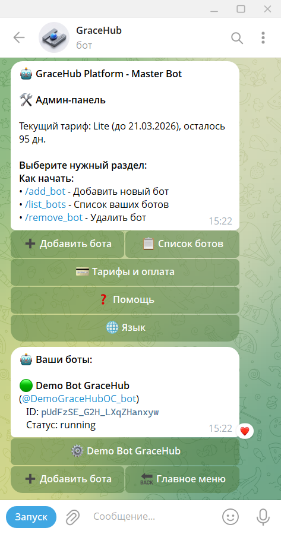
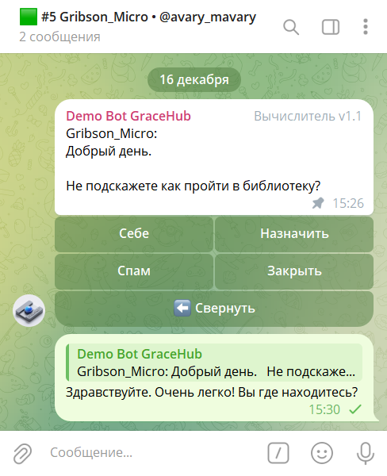

<div align="right">
  <a href="../README.md">🇷🇺 Русский</a> •
  <a href="README.en.md">🇬🇧 English</a> •
  <a href="README.es.md">🇪🇸 Español</a> •
  <a href="README.hi.md">🇮🇳 हिन्दी</a> •
  <a href="README.zh.md">🇨🇳 简体中文</a>
</div>

<div align="center">

> ⚠️ **Important:** This project is in **alpha testing** stage.
> Functionality may change, errors and unstable operation are possible.
> Use with caution and report any issues.

</div>

---

<div align="center">
  <table cellpadding="0" cellspacing="0" style="border: none;">
    <tr>
      <td style="padding: 0; border: none; vertical-align: middle;">
        
      </td>
      <td style="padding: 0 0 0 20px; border: none; vertical-align: middle;">
        <h1 style="margin: 0;">GraceHub Platform</h1>
      </td>
    </tr>
  </table>
</div>

GraceHub is a SaaS platform that allows you to deploy your support directly in Telegram, as well as become a provider of feedback bot and technical support services for small and medium-sized businesses.

**🌐 Website:** [gracehub.ru](https://gracehub.ru)  
**📢 Telegram Channel:** [@gracehubru](https://t.me/gracehubru)  
**👨‍💻 Developer:** [@Gribson_Micro](https://t.me/Gribson_Micro)  
**🗺️ Roadmap:** [ROADMAP.md](./ROADMAP.md)

<div align="center">
  <h3>📱 Interface Screenshots</h3>
  <table>
    <tr>
      <td align="center"></td>
      <td align="center"></td>
      <td align="center"></td>
    </tr>
    <tr>
      <td align="center"><em>Start Page</em></td>
      <td align="center"><em>Dashboard</em></td>
      <td align="center"><em>Adding a Bot</em></td>
    </tr>
    <tr>
      <td align="center"></td>
      <td align="center"></td>
      <td align="center"></td>
    </tr>
    <tr>
      <td align="center"><em>Payment Section</em></td>
      <td align="center"><em>Main Bot Where You Can Bind Support Bot</em></td>
      <td align="center"><em>Support Bot Admin Menu</em></td>
    </tr>
    <tr>
      <td align="center"></td>
      <td align="center"></td>
      <td align="center"></td>
    </tr>
    <tr>
      <td align="center"><em>Customer Request Received</em></td>
      <td align="center"><em>Ticket Management Menu</em></td>
      <td align="center"><em>Reply to Customer</em></td>
    </tr>
  </table>
</div>

## Core Features

- **Master Bot** — central hub for binding all feedback bots
- **Mini App Personal Cabinet** — intuitive interface for managing bots and clients
- **Statistics and Analytics** — track metrics for each bot
- **Billing System** — automatic calculation and payment management

## 🌍 Supported Languages

- 🇷🇺 Русский
- 🇬🇧 English
- 🇪🇸 Español
- 🇮🇳 हिन्दी
- 🇨🇳 简体中文

## 🛠 Tech Stack

| Component | Technology |
|-----------|-----------|
| Backend | Python (FastAPI, Hypercorn) |
| Frontend | React 19 + TypeScript + Vite |
| Bot Management | Telegram Bot API |
| Database | PostgreSQL 15+ |
| Proxy | Nginx |
| Python Version | 3.10+ |

## 📁 Project Structure

```
gracehub/
├── src/
│   └── master_bot/
│       ├── main.py                 # Master bot entry point
│       ├── api_server.py           # REST API server
│       └── worker/                 # Instance workers
├── frontend/miniapp_frontend/      # React application
├── config/                         # Configuration files
├── scripts/
│   └── launch.sh                   # Launch script
├── logs/                           # Application logs
└── .env                            # Environment variables
```

### 💳 Supported Payment Systems

The platform is integrated with the following payment systems to accept payments for support services:

| System | Payment Method | Technical Features |
| :--- | :--- | :--- |
| **Telegram Stars** | Telegram Native Currency | Direct integration with [Telegram Mini Apps Billing](https://core.telegram.org/bots/payments). Payments are processed within the Telegram platform. |
| **TON Coin** | Cryptocurrency (Toncoin) | Direct transfers to TON wallet. Transactions are processed on the TON blockchain without using smart contracts on the platform side. |
| **YooKassa** | Payment Aggregator (RU) | Payment acceptance under law 54-FZ (bank cards, SBP, e-wallets). REST API with webhooks for payment confirmation. |
| **Stripe** | Bank cards (and other Stripe methods) | Accept international payments via the Stripe API; confirm payments via Stripe webhooks. |

## ⚙️ Environment Setup

1. Navigate to the project directory:

```bash
cd /root/gracehub
```

2. Create and configure the environment file:

```bash
cp .env-example .env
nano .env
```

3. Load environment variables:

```bash
source .env
```

4. Create a virtual environment if needed:

```bash
python3 -m venv venv
source venv/bin/activate
```

## 🚀 Running for Development

### Normal Mode (with terminal logs)

```bash
./scripts/launch.sh dev
```

### Background Mode

```bash
./scripts/launch.sh dev --detach
```

The startup includes three processes:
- master bot
- REST API server
- frontend application

## 🔧 Production Deployment via systemd

### Initial Setup and Deployment

```bash
./scripts/launch.sh prod
```

### Service Management

After deployment, manage services via systemd:

```bash
# Check status
systemctl status gracehub-master gracehub-api gracehub-frontend

# Restart services
systemctl restart gracehub-master gracehub-api gracehub-frontend

# Stop service
systemctl stop gracehub-frontend
```

## 📊 Logs and Monitoring

### For Development Mode

Logs are located in the `logs/` directory:

```bash
tail -f logs/masterbot.log
tail -f logs/api_server.log
tail -f logs/frontend-dev.log
```

### For Production

View systemd logs:

```bash
journalctl -u gracehub-master -n 50 --no-pager
journalctl -u gracehub-api -n 50 --no-pager
journalctl -u gracehub-frontend -n 50 --no-pager
```

## 🎯 Usage Instructions

After successful deployment, follow these steps to set up your support:

### Step 1: Connect the Main GraceHub Bot

1. Find the main GraceHub Platform bot in Telegram (which you deployed in the previous steps)
2. Click **Start** or write `/start`
3. The bot will provide you with a personal cabinet and management instructions

### Step 2: Register Your Support Bot

1. In the main bot, select the option to add a new bot
2. Get your Telegram bot token via [@BotFather](https://t.me/botfather)
3. Send the token to the GraceHub Platform bot
4. Your support bot will be activated in the system

### Step 3: Initialize Administrator

1. Write the `/start` command to your new support bot
2. The bot will remember you as an administrator and grant access to management

### Step 4: Create a Super Chat with Topics

1. Create a new group in Telegram
2. In the group settings, enable **"Discussions"** (Topics) mode
3. Add your support bot to this group with administrator rights
4. Make sure the bot has rights to manage messages and topics

### Step 5: Bind Bot to General Topic

1. Open the **General** topic in your super chat
2. Write the binding command:

```
/bind @your_bot_username
```

Replace `@your_bot_username` with your support bot's username.

3. After successful binding, the bot will start accepting customer requests in this topic
4. All customer messages will be automatically distributed across topics in the super chat

### ✅ Done!

Your support system in Telegram is fully configured. Your business customers will be able to write to the bot, and you will see all requests in a convenient super chat interface with topic separation.

## 📄 License

MIT
