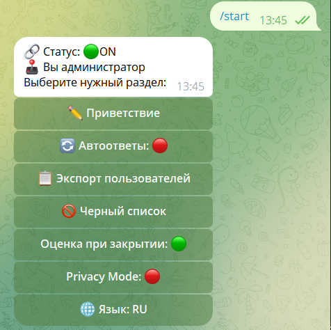

# Режимы и настройки администратора

У администратора, который подключал своего бота поддержки к GraceHub Platform Bot через админку в своём боте есть возможности для настроек. Давайте их разберем.

## Приветствие

Настройка приветственного сообщения для новых пользователей.

## Автоответы

Конфигурация автоматических ответов на сообщения пользователей.

## Экспорт пользователей

Функция экспорта списка пользователей в различные форматы.

## Чёрный список

Управление чёрным списком для блокировки нежелательных пользователей.

## Оценка при закрытии

Настройка системы оценки качества обслуживания при закрытии обращения.

## Privacy Mode

Конфигурация режима приватности для защиты данных пользователей.

## Язык

Выбор языка интерфейса администратора и ботов.

