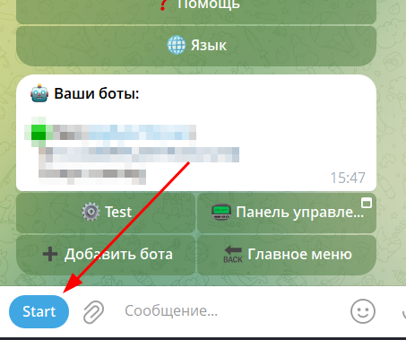
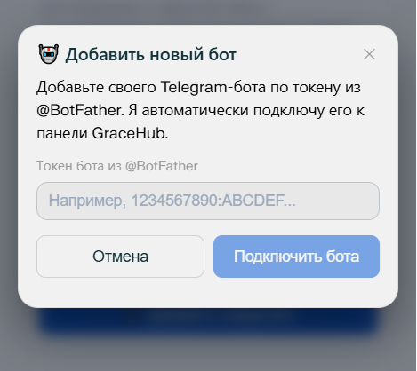
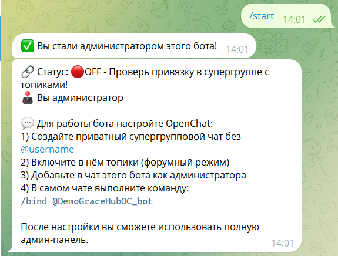

# Первый запуск через Mini App

Это руководство проведет вас через процесс настройки вашего первого бота поддержки с использованием графического интерфейса GraceHub.

!!! warning "Важно"
    Предполагается, что вы уже получили токен бота у @BotFather, а так же создали супер-чат с включенным режимом "Топики". Важно, чтобы чат был приватным, не публичным!

## Шаг 1. Запуск приложения

Откройте основного бота платформы и запустите Mini App.



## Шаг 2. Добавление бота

В главном меню нажмите кнопку **"Добавить новый бот"**.


## Шаг 3. Подключение токена

Введите токен API, который вы получили при создании бота в [@BotFather](https://t.me/BotFather).



После успешного ввода вы попадете на **Дашборд** управления ботом.

## Шаг 4. Инициализация администратора

Теперь необходимо активировать права администратора:

1. Перейдите в диалог с вашим **новым ботом поддержки**.
2. Отправьте команду `/start`.

Бот запомнит ваш аккаунт как администратора. В будущем доступ к админ-меню будет только у вас.



## Шаг 5. Привязка к суперчату

Для обработки заявок необходимо привязать бота к рабочей группе (суперчату):

1. Создайте группу и включите в ней **Темы (Topics)**.
2. Добавьте бота в группу и назначьте его **администратором** (с правами управления темами).
3. В теме **General** отправьте команду:

```bash
/bind @your_bot_username
```


Готово! Теперь бот настроен и готов принимать обращения.

